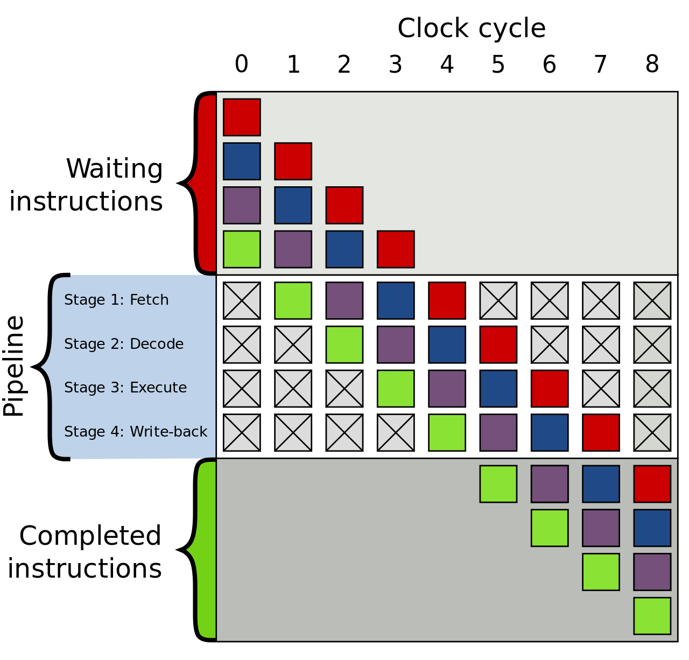

# Not all instructions are created equal

It's amazing what microprocessors can do in such small scale, always trying to get the most from every clock cycle.


CISC architectures even more so; most modern processors internally convert the often hard to deal with CISC instructions into RISC, in order to more efficiently peform instruction optimization.

One very interesting characteristic of CISC is that instructions have variable lenghts. It's something we don't often think about but instructions also require bytes to exist somewhere!

In the Intel CISC world, different instructions can take different clock cycles to execute.

During the rest of this post, I'll be refering to Intel processors, unless otherwise indicated.
We'll see how C++ compilers can sometimes optmize the code in ways that are not always beneficial

## Microprocessors architecture 

Before we get too deep into examples, let's quickly review a few characteristics of microprocessor architecture.

Note we'll barely scratch the surface of this subject. There is just too much to consider and understand the internals of microprocessors.
Not to mention the fact that vendors keep the details very, very secret.

I put some links in the references section of this article, that hopefuly will help with some things.

Most, if not all, Intel microprocessors are pipelined, which means instructions can be *processed* in a stages, reducing the number of cycles required for executing each instruction.

The most common pipeline steps are

1. fetch
2. decode
3. execute
4. memory access
5. memory write back

but in really, most modern processor have many more steps, some over 20. The image below has become famous and I recommend reading the [wikipedia article](https://en.wikipedia.org/wiki/Instruction_pipelining) where it came from.



Here's where things get interesting

### The instruction cache and fused instructions

As I mentioned eariler in this post, different instructions are encoded in different sizes and require different clock cycles to execute. 
Now, there's no directy relationship between the number of bytes an instruction uses and the number of clock cycles required to execute it.

However, the instructions in the pipeline waiting to be processed (see image above) are kept in the **instruction cache**. 
This cache varies in size and it is usually one per physical processor core (and usually shared by hyperthreaded cores) and have very low access latency, when compared to other cache levels or the main memory.

So the less instructions our code has, the more we can fit in the cache and avoid fetching instructions from other layers or the main memory. 

As a side note, there's also a lot to talk about memory and caching and I'll probably cover it in another post. I strongly suggest reading the paper [What Every Programmer Should Know About Memory](https://people.freebsd.org/~lstewart/articles/cpumemory.pdf) on the subject, after your done reading this post :)

Keeping the instruction count small also reduces the chance of them being evicted from the instruction cache, which is one of major sources of overhead in ultra low latency systems.

The instructions are also not the thing the processor will, well *process* in the end. Instructions are converted into micro operations that the hardware uses during the execution of the instruction.

In addition, recent architectures - starting with Intel's Sandy Bridge - can combine and cache micro operations using a techinique called fusion. 

There are (at least) 3 types of fusion in the Sandy Bridge and newer architectures:

1. micro fusion: when micro operations from the same instructions are combined (fused) into one single micro operation
2. macro fusion: when micro ops from multiple instructions are fused into one micro op
3. instruction fusion: when 

Again, this subject is too deep and complex to cover here. The point I'm trying to get to is that micro operations are also cached and the more they can be fused, more fit into the cache.

This can save the processor significant time; during the decode phase of the pipeline, if a set of instructions is present in the micro operations cache, they don't need to be decode or go through the rest of the pipeline steps before execution.

There are fantastic and very complicated components in the processor to manage the intruction and micro operation cache. Maybe another day...

### Compilers for the rescue

People who write compilers are well aware (a lot more than me) of these processor features and developers do amazing things to get the best of the CPU. 

On certain situations, the code will be generated such that fewer are used. 
In some other cases, more instructions can be used for the same result, usually when these instructions have much lower latency (require less clock cycles to execute), or are specialized instructions.

Such is the case for SIMD  (Single Instruction Multiple Data) instructions. These instructions are designed to work on vectors, having dedicated registers and components used in their execution.

You know how good GPUs are at processing vectors and matrices? 
Well, CPUs also have similar capabilities, albeit in a significantly smaller and slower scale. 

Most CPUs also have more than one unit capable of executing SIMD instructions and depending on the isntruction, they can be executed in parallel.

So the compiler sees that our carefully written C++ code is performing operations on a vector, for example, and concludes the best way go about it is using SIMD instruction. A process known as autovectorization.

Let's look at a couple of examples, using my [favourite benchmarking framework](microbench-01.md).

```c++
#include <benchmark/benchmark.h>

using namespace std;

#define ARRAY_LENGTH 2048

static void BM_arrayIndex(benchmark::State& state) {          
    const int length = ARRAY_LENGTH;
    
    int* values = new int[length];    
    // populate values

    unsigned int x = 0;
    for (auto _ : state){                                
        for(int i = 0 ; i < length ; i++){
            x += values[i];
        }                
    }
    benchmark::DoNotOptimize(x);

    delete[] values;
}

static void BM_pointerIncrement(benchmark::State& state) { 
    // add one to the array for the sentinel value
    const int length = ARRAY_LENGTH+1;
    const int sentinel = 1;
    
    int* values = new int[length];    
    // populate values but make sure the sentinel value does not exist before the end
    
    // set the last position as the sentinel
    values[length-1] = sentinel;
    
    unsigned int x = 0;
    for (auto _ : state){                
        int* p = values;
        while(*p != sentinel){
            x += *p;
            p++;            
        }       
    }    
    benchmark::DoNotOptimize(x);
    delete[] values;
}


BENCHMARK(BM_arrayIndex);
BENCHMARK(BM_pointerIncrement);

BENCHMARK_MAIN();
```


Before I show you the results, let's look at the generated assembly code for `BM_arrayIndex` and `BM_pointerIncrement`.
I used clang 7 with the compiler flags I used were `-O3 -g -fno-exceptions -fno-rtti -mno-omit-leaf-frame-pointer -fno-omit-frame-pointer`

The compiler made generous use of SIMD instructions for `BM_arrayIndex`. Below the relevant code executed in the inner `for` loop
```c++
0x1000011d0 <+128>: movdqu xmm2, xmmword ptr [rbx + 4*rax]
0x1000011d5 <+133>: paddd  xmm2, xmm1
0x1000011d9 <+137>: movdqu xmm1, xmmword ptr [rbx + 4*rax + 0x10]
0x1000011df <+143>: paddd  xmm1, xmm0
0x1000011e3 <+147>: movdqu xmm0, xmmword ptr [rbx + 4*rax + 0x20]
0x1000011e9 <+153>: movdqu xmm3, xmmword ptr [rbx + 4*rax + 0x30]
0x1000011ef <+159>: movdqu xmm4, xmmword ptr [rbx + 4*rax + 0x40]
0x1000011f5 <+165>: paddd  xmm4, xmm0
0x1000011f9 <+169>: paddd  xmm4, xmm2
0x1000011fd <+173>: movdqu xmm2, xmmword ptr [rbx + 4*rax + 0x50]
0x100001203 <+179>: paddd  xmm2, xmm3
0x100001207 <+183>: paddd  xmm2, xmm1
0x10000120b <+187>: movdqu xmm1, xmmword ptr [rbx + 4*rax + 0x60]
0x100001211 <+193>: paddd  xmm1, xmm4
0x100001215 <+197>: movdqu xmm0, xmmword ptr [rbx + 4*rax + 0x70]
0x10000121b <+203>: paddd  xmm0, xmm2
0x10000121f <+207>: add    rax, 0x20
0x100001223 <+211>: cmp    rax, 0x800
0x100001229 <+217>: jne    0x1000011d0 ; if i != 2048, go back to the begining of the loop
```

for `BM_pointerIncrement`, the code is more straightforward 
```c++
0x100001360 <+240>: add    eax, ecx
0x100001362 <+242>: inc    ebx
0x100001364 <+244>: mov    ecx, dword ptr [rdx]
0x100001366 <+246>: add    rdx, 0x4
0x10000136a <+250>: cmp    ecx, 0x1
0x10000136d <+253>: jne    0x100001360 ; not equals to 1, go back to the begining of the loop
```

One note about the implementation of `BM_pointerIncrement`; it uses an optimization technique called [Sentinel Value](https://en.wikipedia.org/wiki/Sentinel_value) where the idea is to change the termination condition for a loop. 
I'll cover its use in a future post but for now, know that the use of a sentinel in this example is not the main reason for the different results.

Which one do you think will perform better? Hint, the answer is not obvious :)

On one hand, we have the SIMD instructions processing 128 bytes per iteration (after part of the loop was unrolled), using more data per instructions as it should. The loop in `BM_arrayIndex` is unrolled, that is why it looks like there is more code than `BM_pointerIncrement`.

But even if `BM_pointerIncrement` was unrolled, we'd still have a lot less instructions in total. And less instructions are better for our instruction cache, as we saw above.

Now, to the results. I executed this on a Broadwell Intel (5th Generation) with support for SSE 4.2, AVX and AVX2.

```
--------------------------------------------------------------
Benchmark                    Time             CPU   Iterations
--------------------------------------------------------------
BM_arrayIndex              107 ns          107 ns      6153522
BM_pointerIncrement        852 ns          850 ns       814266
```

The difference is incredible, the SIMD code is almost 4x faster.
The results must seem a bit surprising, at first, given there's a lot more instructions to be interpreted in the `BM_arrayIndex` code. But it makes sense once we understand what is happening.

First let me say that this results will certainly vary from CPU to CPU and I wouldn't be surprised if results were very similar on another CPU.

Aside from the fact the implementation of `BM_pointerIncrement` had produced fewer instructions, the SIMD instructions can process more data per clock cycle and are probably being executed in concurrently by the processor ports - there should be 3 vector ALU for integers in my case.

Although there is more data being moved from cache to the xmm registers, and there's precious time being spent on that, the vector `values` is small and can fit nicelly in the data cache.
Also, the length of `values` perfectly aligns with the size of each xmm register (16 bytes, in this case), avoiding reaching across cache lines.

One less note, different compilers will produce different results. To try that, I strongly suggest checking out the code in [compiler explorer](https://gcc.godbolt.org/#z:OYLghAFBqd5QCxAYwPYBMCmBRdBLAF1QCcAaPECAKxAEZSAbAQwDtRkBSAJgCFufSAZ1QBXYskwgA5NwDMeFsgYisAag6yAwoILoGeAEYA6BBuwcADAEFLVgpgC2AB2b31WpU0GDVAFSdmtgr6LJiqAG6oeOiq6KgAcqgEAPJOBHgOeABemBD%2B3ABsEUzKmACU6gDsfNZyeABmsZj1CpjoEAD6HZ5sXWW2qqpeDhGorngMudxc06og6lwzvGQO0xDhJSLlczvTDo4kAJ7T/bI1NlyymAyCmANDgiOR45MQ07Pz77wOpMRrG6UKvNPot9g4jicNOc5JgWPh6rYOJUACKI6yRaKqYisOIOABiEwYEAUBAAVLEmAQmKRVCTVJM2AQEDS6YIANZ4Jz9ar3Qb1EjElgEWnuZGqCzuHgijSaemw4BMyW0/j8bnnQYajXoSlMDgAVh4eH1Yo0YuxcNQDggp3Vmo1DQg2qp%2BsNxtFptU7M5at5ds1Tt1BqNepNsjFFihvs1SNR1mjKMRCdq6KiMSYxGxhwAknDMAAPa1I22DNAsHS0oVyxkIUWqLgWAAsAA5I3GNb6SeSAVsfB7QgB3CsEF0MhWmENQ6Ntwbm3EEhhE7uYQQ00dMmkWG2%2BkRlvDAUIxOl52sRs5TmzT1T84iC4V4E9K%2B8yqtjx8q3g%2By%2Ba48qsPFUqCC6waomcvoxn6EHtpecSJCkaQZNkuR5lu0HXJg9gum6S6AaBtRJheVgYjEThREKmDEDmyDEI4sIEIWPKXqW5Z0muNYevWzb8LQrZWJqTF3pWtxCq0DC1txuG8VBkmDJ2/49rWA5DiO8pMsak5SZqs6WvOi6bMuq4qcynq0SJKHSeol4APSWcZwpMmEzDliRgiEHgqAsA8qj2cZwmhAwvrYcp1YALTcSGtZCekfk8R2Qrkk4taBRJmo7i5%2B5tEOqg/n%2Bp7FhZ5n9ggEy5KSCVgGAHqRaZRZRhqP68B6pU8ZBAQNQ1yXtiikGQbVgy%2BjBSSpOkmQ5BAyHNVqaEYQaWF6Th0IolIZSMNIepSKQLDSBY62oNImjvlKwhiBICyyLQ60EFtS3LWyIB6hYK1SA262bVI22kLtUjrYIIAPZdb1LaQcCwEgaDOMVZAUBAYNOBDIDAE2sikC0DD2MQP0QAYV2kAYCjpoc0jnaQYP7EKyQsAwBMA6QWAOKwwCTNj%2BDUcg6ThMu2P5pgyAiPYhPrSS1zY/oBjYsQhyaBgkhSETBDEBk/PLcwbAoAdjCGD9kDLag8HuT9UjBcksjfaI4iSLQSurS92OfXmTYFMFBQNqowDIMgqhNkYsiqBAuCECQp30Kokvg5MxCBxU%2B1tTwF1XWUN13Q9DDSM9G029I32/aQ/3bfHj1cNb1OfbHAN5%2Bz6NuZtDZAA%3D).

Compiler explorer is an absolutely fantastic tool and I cannot recomend it enough.

As a final thought, consider the use of autovectorization carefully. It can be of great benefit but you'll want to have some control over what is happening so it does not end up hindering the performace of your application.

The full example code used in this article is [found here](../code/instructions-01_ce.cpp)


## References

1. [Intel® 64 and IA-32 Architectures
Optimization Reference Manual](https://software.intel.com/sites/default/files/managed/9e/bc/64-ia-32-architectures-optimization-manual.pdf)
2. [SIMD at Insomniac Games](https://deplinenoise.files.wordpress.com/2015/03/gdc2015_afredriksson_simd.pdf)
