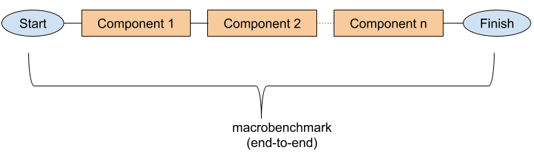

# Microbenchmarking C++ code
We don’t need to microbenchmark our application. Except when we find out we do.

In the interest of making the best use of our time, let me start by saying that microbenchmarking code - any code - can quickly have us spiraling through a very frustrating rabbit hole.

However, so long as we all understand that and the fact the benefits of optimizing code decrease very quickly with the size of your universe - *e.i* less code == more pain and less gain - then we can make the best of it.

If your day job is trying to write code, critical code, where the accepted latency is in measured microseconds, then you'll inevitably find yourself having to microbenchmark a piece of code. Most likely the hot (critical) path in the application.

## Results are what really matter
Let’s imagine I need to make my high frequency trading application perform a few microseconds faster. Time is indeed money in this case.
I can optimize and tweak all the code I want and even be able to make some of that code substantially faster.

However, if the overall processing time, from data received until a trade is made, doesn't get me more and correct trades, the benefits can be, let’s say, contestable.

That’s why we always need to measure the overall performance of the system, from end-to-end, wire-to-wire, from packets arriving in the network card to an order being put on the exchange or a frames rendered on the screen (if games are your thing).



Macrobenchmarking is vital, make no mistake

## The three important things: measure, measure and measure
Say after I benchmark my entire system, I found the hotspot to be a specific algorithm in one of the components. What do I do?

I get on to thinking of a solution and I have to benchmark my changes. But, not so fast.

No matter what you do, before starting changing code, measure it well and continue measuring throughout the process.

There are many ways to approach benchmarking and measurement and we’ll look into that in another article.
Right now, we’re going to look into benchmarking a portion of the code (hence **micro**benchmarking).


## Microbenchmarking with Google benchmark
In this article, we'll be using [Google Benchmark](https://github.com/google/benchmark), a fantastic microbenchmarking framework for C++.
I'm not going to cover all of its features but hopefully the majority of the common use cases. The project's page on github is very well documented and I recommend reading it once you're comfortable with the basics.

In addition to Google benchmark, I'll be using clang 7, lldb and objdump for compiling and analyzing the generated assembly code.

To start with, follow the install instructions on the Google benchmark project page. The easiest steps at the time of this writting would be

```
git clone git@github.com:google/benchmark.git
mkdir build && cd build
cmake .. -DBENCHMARK_ENABLE_GTEST_TESTS=OFF -DCMAKE_BUILD_TYPE=RELEASE
```

This will create a `libbenchmark.a` file that together with the `include` directory, it's all we'll need in our examples

#### The (very) basics

I'm going to start with an extremely simple tha will also help us understand what the compiler is doing with our code.
```c++
#include <benchmark/benchmark.h>

static void BM_simpleTest(benchmark::State& state) {      
    for (auto _ : state){
        // intentionally do nothing
    }
}

BENCHMARK(BM_simpleTest);

BENCHMARK_MAIN();
```

So the code is, well, simple; `BM_simpleTest` is the function we want to measure and needs to have the signature the framework recognizes.
`BENCHMARK()` registers the functions we want to benchmark while BENCHMARK_MAIN() uses the framework built in `main` function to execute the code.

The output on my Macbook Pro is
```
Run on (4 X 2700 MHz CPU s)
CPU Caches:
  L1 Data 32K (x2)
  L1 Instruction 32K (x2)
  L2 Unified 262K (x2)
  L3 Unified 3145K (x1)
Load Average: 2.32, 2.42, 2.71
--------------------------------------------------------
Benchmark              Time             CPU   Iterations
--------------------------------------------------------
BM_simpleTest      0.000 ns        0.000 ns   1000000000
```

Note the information in the begining of the report. It can be very useful for understanding the conditions in which the code is executing. For example, my computer has 4 cores but 2 unified L1 cache, which means it's shared by 2 execution cores. This processor has 2 actual cores plus 2 with hyperthreading.

Also, not how fast the code run, 0 nanos :) amazing. That's because it's not doing anything.

Let's look at the assembly output of the generated code. For that, I'm using lldb set for the Intel idiom.
The code was compiled with clang 7, and the flags `-O3 -g -fno-exceptions -fno-rtti -mno-omit-leaf-frame-pointer -fno-omit-frame-pointer`. 

```c++
0x100001430 <+0>:  push   rbp
0x100001431 <+1>:  mov    rbp, rsp
0x100001434 <+4>:  push   rbx
0x100001435 <+5>:  push   rax
0x100001436 <+6>:  mov    rbx, rdi
0x100001439 <+9>:  call   0x100001ab0               ; benchmark::State::StartKeepRunning()
0x10000143e <+14>: mov    rdi, rbx
0x100001441 <+17>: add    rsp, 0x8
0x100001445 <+21>: pop    rbx
0x100001446 <+22>: pop    rbp
0x100001447 <+23>: jmp    0x100001b80               ; benchmark::State::FinishKeepRunning()
0x10000144c <+28>: nop    dword ptr [rax]
```

You don't need to really know assembly for this, I just want to display the boundaries of the benchmark execution code, and its contents. The generated assembly doesn't have anything in it, as expected.
That explain the benchmarked code taking 0ns to run.

Back to the benchmark output, note the column `Iterations`. That shows the number of times the code had to be executed until an stable value was reached. This library does some amazing things to try and find the most stable result set. 

As you can imagine, there could be a lot of variance in microbenchmarking and the tail, is something very dangerous and critical to be considered. I'll talk more about that in another post.

Let's try another case, say we want to measure the time it takes to increment a single variable

``` C++
#include <benchmark/benchmark.h>

static void BM_simpleTest(benchmark::State& state) {      
    for (auto _ : state){
        int x = 42;
        x++;
    }
}

BENCHMARK(BM_simpleTest);

BENCHMARK_MAIN();
```

The output being
```
--------------------------------------------------------
Benchmark              Time             CPU   Iterations
--------------------------------------------------------
BM_simpleTest      0.000 ns        0.000 ns   1000000000
```

Still 0 nanoseconds, which maybe correct but it is suspicious. Let's look at the assembly code again

```c++
0x100001480 <+0>:  push   rbp
0x100001481 <+1>:  mov    rbp, rsp
0x100001484 <+4>:  push   rbx
0x100001485 <+5>:  push   rax
0x100001486 <+6>:  mov    rbx, rdi
0x100001489 <+9>:  call   0x100001ac0               ; benchmark::State::StartKeepRunning()
0x10000148e <+14>: mov    rdi, rbx
0x100001491 <+17>: add    rsp, 0x8
0x100001495 <+21>: pop    rbx
0x100001496 <+22>: pop    rbp
0x100001497 <+23>: jmp    0x100001b90               ; benchmark::State::FinishKeepRunning()
0x10000149c <+28>: nop    dword ptr [rax]
```

It looks exactly like the previous one, where we had an empty loop. 
You probably already guessed what is going on, the compiler is optimizing away the code we wrote. And we do want the optimizations on.

Thankfully, Google benchmark has a solution for that, a nice little trick in the form of the method `benchmark::DoNotOptimize()`
Let's add that to our code
```c++
static void BM_simpleTest(benchmark::State& state) {      
    for (auto _ : state){
        int x = 42;
        x++;
        // here we tell the compiler that may be used by other cpus
        // so don't eliminate it just yet
        benchmark::DoNotOptimize(x);
    }
}
```

The output this time is
```
--------------------------------------------------------
Benchmark              Time             CPU   Iterations
--------------------------------------------------------
BM_simpleTest      0.331 ns        0.330 ns   1000000000
```

That's more like it, pretty fast but not zero. Let's look at the assembly code again. Last time, I promise you.

```c++
0x10000144d <+13>: mov    r15b, byte ptr [rdi + 0x1a]
0x100001451 <+17>: mov    rbx, qword ptr [rdi + 0x10]
0x100001455 <+21>: call   0x100001ab0               ; benchmark::State::StartKeepRunning()
0x10000145a <+26>: test   rbx, rbx
0x10000145d <+29>: je     0x10000147c               ; <+60> [inlined] benchmark::State::StateIterator::operator!=(benchmark::State::StateIterator const&) const + 5
0x10000145f <+31>: test   r15b, r15b
0x100001462 <+34>: jne    0x10000147c               ; <+60> [inlined] benchmark::State::StateIterator::operator!=(benchmark::State::StateIterator const&) const + 5
0x100001464 <+36>: nop    word ptr cs:[rax + rax]
0x10000146e <+46>: nop
0x100001470 <+48>: mov    dword ptr [rbp - 0x1c], 0x2b ; this where our variable is initialized and set
0x100001477 <+55>: dec    rbx
0x10000147a <+58>: jne    0x100001470               ; <+48> at MicroBench.cpp
0x10000147c <+60>: mov    rdi, r14
0x10000147f <+63>: call   0x100001b80               ; benchmark::State::FinishKeepRunning()
0x100001484 <+68>: add    rsp, 0x8
```

There's a lot more going on this time, we can see the framework's code for state tracking present as well as our own code at address `0x100001470`. Note it's set to `0x2b` which is 43. Our friend compiler took the liberty to initialize the variable to its final value.

The method `benchmark::ClobberMemory()` can also be used to get around compiler optimizations but this one will create a memory barrier and force all variables to be written to memory, which may not be what you want at all times so use it carefully.

Let' look at a another feature in a little more elaborate example. 

```c++
static void BM_simpleTest(benchmark::State& state) {              
    const int length = 2048;
    int values[length];
    // populate values
    unsigned long x = 0;
    
    for (auto _ : state){             
        for(int i = 0 ; i < length ; i++){
            x += values[i];
        }
    }
    
    benchmark::DoNotOptimize(x);
}

BENCHMARK(BM_simpleTest);
```

We just to want to add all the numbers in an array, ignoring the potential overflow. Note we left the initialization of the array outside the state loop to avoid adding that to the final result, since all we care about is the time it takes to scan the array and add to our accumulator.

Let's say we want to do the same but for several different lengths of `values`. We can do that by calling with arguments. 

We can pass parameters to our code by invoking the method `Arg()` in the object returned by the `BENCHMARK()`. This can be done multiple times and each time will execute our benchmark test with a different parameter.

Let's tweak our code a bit to make that work

```c++
static void BM_simpleTest(benchmark::State& state) {          
    const int length = state.range(0);
    
    int* values = new int[length];    
    // populate values
    unsigned long x = 0;    
    
    for (auto _ : state){                
        for(int i = 0 ; i < length ; i++){
            x += values[i];
        }                
    }
    
    benchmark::DoNotOptimize(x);
    delete[] values;    
}

BENCHMARK(BM_simpleTest)->Arg(1 << 2)->Arg(1 << 3)->Arg(1 << 5)->Arg(1 << 10)->Arg(1 << 15);
```

`state.range(0)` contains the arguments being passed to our benchmarking function. The `Arg` method allows passing multiple parameters, each returning in a different index in `range`.

The output of this execution is
```
--------------------------------------------------------------
Benchmark                    Time             CPU   Iterations
--------------------------------------------------------------
BM_simpleTest/4           1.96 ns         1.96 ns    356206905
BM_simpleTest/8           2.61 ns         2.61 ns    268194096
BM_simpleTest/32          6.92 ns         6.90 ns     95709481
BM_simpleTest/1024         179 ns          179 ns      3904790
BM_simpleTest/32768       6011 ns         6000 ns       112604
```

Note how less iterations are required to get to a more stable run.

That's it for now, for more information about the tools used in this articles, see:

[Google benchmark git repository](https://github.com/google/benchmark)

[The LLDB Debugger page](https://lldb.llvm.org/tutorial.html)